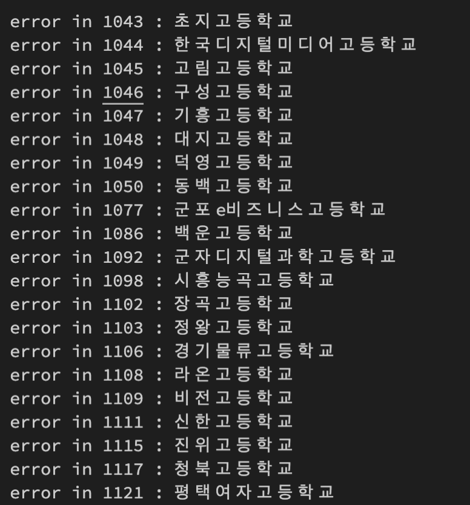

# 🎒 전국 고등학교 로고 모음 🎒

## 데이터를 얻어보자

[KESS 교육통계 서비스(링크)](https://kess.kedi.re.kr/post/6717688?itemCode=04&menuId=m_02_04_02_01&code=&words=주소록) 에서 `2020년 하반기 유초중등교육기관 주소록 ('20.10.1.)`를 받아준다. ➜ [origin.xlsx](data/origin.xlsx)

정리가 참 잘되어있다 .. 

> 
> 유치원부터 고등학교까지 모두 있다. 너무나 체계적이여서 놀람

## `고등학교`만 추출

[소스코드보기 (extract-highschool.py)](extract-highschool.py)

`학제`라는 열이 있어서 초중고를 쉽게 구별 할 수 있을 것 같다. `pandas`로 파일을 읽었는데, 열의 이름을 판별할 수 있는 데이터가 4번째 행에 있어서 `loc`함수가 제대로 작동하지 않았다. 어쩔 수 없이 첫째줄로 옮겨주었다. 

```Python
# Phase 1
# extract-highschool.py
# 고등학교만 추출해보자 

# 학제, 시도, 학교명, 홈페이지면 필요한 정보는 모두 있는 것 같다. 
df = data.loc[:, ['학제', '시도', '학교명', '홈페이지']]

# 학제가 고등학교인 행만 추출
df_highschools = df[df['학제'] == '고등학교']

# 추출했으니 학제도 이제 필요없다. 
df_result = df_highschools.loc[:, ['시도', '학교명', '홈페이지']]
```

> 
> 데이터 정제후, 다음과 같이 엑셀파일로 export 해주었다. 원하는 데이터만 잘 정리 되었음
> [결과 파일](data/highschool-extracted.xlsx)

## 본격적인 크롤링을 해보자

[소스코드보기 (crawl-logo.py)](crawl-logo.py)

몇개의 고등학교 이름을 구글에 검색해본 결과, `xx고등학교 로고`를 검색하면 대부분 **첫번째** 이미지로 나온다는 것을 알았다.


`고등학교이름 + '로고'`형식으로 검색해서 나오는 첫번째 이미지를 받으면 되지 않을까라는 생각을 하게되었다. `selenium` 라이브러리를 활용했다. ~~크롤링하는게 보여서 재밌다~~

 이미지를 저장하는 `urllib.request.urlretrieve` 함수는 지정된 경로가 없을 경우 에러를 내기 때문에, 각 시도별로 깔끔히 정리하기 위해서 다음과 같은 함수를 만들어주었다.

```Python
def make_city_path(df):
    # '시도'로 묶는다.
    city_df = df['시도'].groupby(df['시도']).describe()

    # 각 '시도' 마다 폴더를 생성한다. 이미 경로가 존재하면 패스 
    for index, row in city_df.iterrows():
        os.makedirs(f"result/{row.name}", exist_ok = True)
```

반복적인 크롤링을 해내기 위해서 `crawl_image`함수 또한 만들어 주었다. 

```Python
crawl_image(driver, "경기", "한국디지털미디어고등학교")
```
와 같이 사용한다.

모든 준비가 끝났고 크롤링을 시작했다. 그러나 앞부분 몇 학교를 크롤링하다보니, 종종 에러가 나는 경우가 있었다. 일단 에러는 패스하고, 에러가 나면 출력을 해주기로 했다. 

> 
> 에러의 수가 급격히 늘어났던 구간

다 하고 보기 700개가 넘는 학교가 에러가 났었다 .. [에러 리스트(error-list.txt)](data/error-list.txt)


- [ ] 고등학교만 추출
- [ ] 지역별 정리
- [ ] 이미지 크롤링
- [ ] 마크다운 생성
