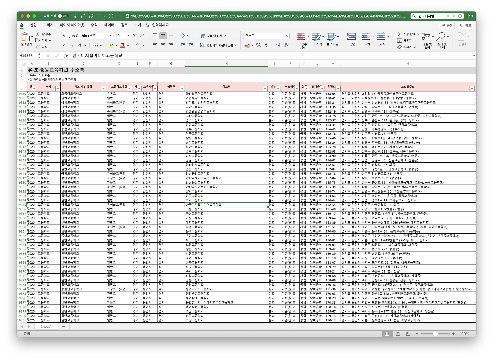
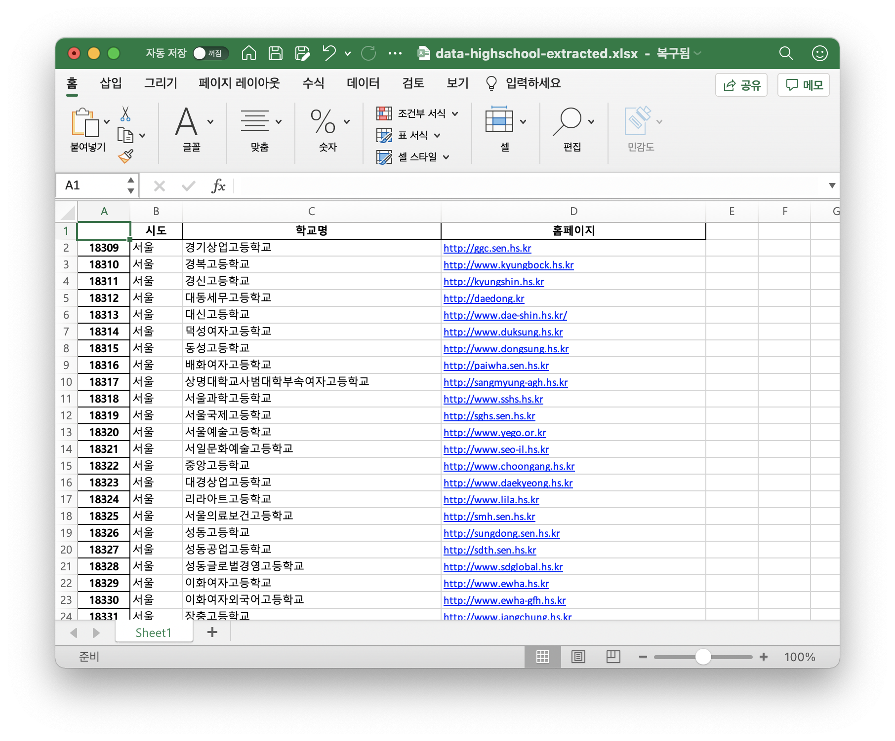

# 🎒 전국 고등학교 로고 모음 🎒

## 데이터를 얻어보자

[KESS 교육통계 서비스(링크)](https://kess.kedi.re.kr/post/6717688?itemCode=04&menuId=m_02_04_02_01&code=&words=주소록) 에서 `2020년 하반기 유초중등교육기관 주소록 ('20.10.1.)`를 받아준다. ➜ [data.xlsx](data.xlsx)

정리가 참 잘되어있다 .. 

> 
> 유치원부터 고등학교까지 모두 있다. 너무나 체계적이여서 놀람

## `고등학교`만 추출

[소스코드보기 (extract-highschool.py)](extract-highschool.py)

`학제`라는 열이 있어서 초중고를 쉽게 구별 할 수 있을 것 같다. `pandas`로 파일을 읽었는데, 열의 이름을 판별할 수 있는 데이터가 4번째 행에 있어서 `loc`함수가 제대로 작동하지 않았다. 어쩔 수 없이 첫째줄로 옮겨주었다. 

> 
> 데이터 정제후, 다음과 같이 엑셀파일로 export 해주었다!! 원하는 데이터만 잘 정리 되었음!!
> [결과 파일](data/highschool-extracted.xlsx)

```Python
# Phase 1
# 고등학교만 추출해보자 

# 학제, 시도, 학교명, 홈페이지면 필요한 정보는 모두 있는 것 같다. 
df = data.loc[:, ['학제', '시도', '학교명', '홈페이지']]

# 학제가 고등학교인 행만 추출
df_highschools = df[df['학제'] == '고등학교']

# 추출했으니 학제도 이제 필요없다. 
df_result = df_highschools.loc[:, ['시도', '학교명', '홈페이지']]
```

- [ ] 고등학교만 추출
- [ ] 지역별 정리
- [ ] 이미지 크롤링
- [ ] 마크다운 생성
