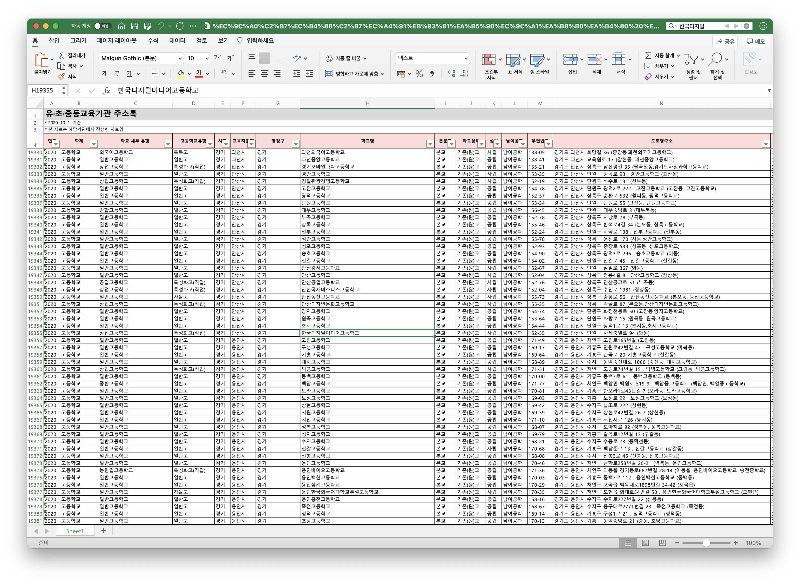

# 전국 고등학교 로고 모음

### 데이터셋

[KESS 교육통계 서비스(링크)](https://kess.kedi.re.kr/post/6717688?itemCode=04&menuId=m_02_04_02_01&code=&words=주소록) 에서 `2020년 하반기 유초중등교육기관 주소록 ('20.10.1.)`를 받아준다. ➜ [data.xlsx](data.xlsx)

> 
> 유치원부터 고등학교까지 모두 있다.
